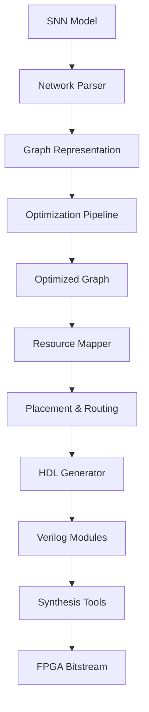

# Architecture Documentation

## System Overview

The Spiking-FPGA-Toolchain implements a complete end-to-end pipeline for compiling spiking neural networks (SNNs) to FPGA hardware. The architecture follows a layered approach with clear separation of concerns.

## High-Level Architecture

```
┌─────────────────────────────────────────────────────────────────┐
│                        Frontend Layer                          │
├─────────────────────────────────────────────────────────────────┤
│  PyNN/Brian2 Models → SNN Graph → Optimization Pipeline        │
└─────────────────────────────────────────────────────────────────┘
                                │
                                ▼
┌─────────────────────────────────────────────────────────────────┐
│                      Compilation Layer                         │
├─────────────────────────────────────────────────────────────────┤
│  Graph Analysis → Resource Mapping → HDL Generation            │
└─────────────────────────────────────────────────────────────────┘
                                │
                                ▼
┌─────────────────────────────────────────────────────────────────┐
│                        Backend Layer                           │
├─────────────────────────────────────────────────────────────────┤
│  Vivado/Quartus Integration → Synthesis → Bitstream           │
└─────────────────────────────────────────────────────────────────┘
```

## Core Components

### 1. Frontend Parser (`src/compiler/frontend/`)
- **Purpose**: Converts high-level SNN descriptions to internal graph representation
- **Input**: PyNN/Brian2 network definitions, YAML configuration files
- **Output**: Normalized graph structure with neurons, synapses, and connectivity
- **Key Classes**: `NetworkParser`, `GraphBuilder`, `ModelValidator`

### 2. Graph Optimizer (`src/compiler/optimizer/`)
- **Purpose**: Applies optimization passes to improve hardware efficiency
- **Passes**: 
  - Spike compression and deduplication
  - Synapse pruning based on weights
  - Neuron clustering for resource sharing
  - Memory access pattern optimization
- **Key Classes**: `OptimizationPipeline`, `PassManager`, `ResourceEstimator`

### 3. HDL Generator (`src/compiler/backend/`)
- **Purpose**: Generates synthesizable Verilog/VHDL from optimized graph
- **Templates**: Parameterized HDL modules for neurons, routers, memory interfaces
- **Customization**: Support for custom neuron models and connectivity patterns
- **Key Classes**: `HDLGenerator`, `ModuleTemplate`, `ParameterBinder`

### 4. Runtime System (`src/runtime/`)
- **Purpose**: Host-FPGA communication and runtime management
- **Features**: Spike injection, weight updates, monitoring, debugging
- **Interfaces**: PCIe, JTAG-UART, AXI4-Stream
- **Key Classes**: `FPGAInterface`, `SpikeBuffer`, `RuntimeManager`

## Data Flow



## Memory Architecture

### On-Chip Memory Hierarchy
- **L1**: Neuron state registers (voltage, threshold, refractory)
- **L2**: Synaptic weight BRAM (compressed, sparse representation)
- **L3**: Spike buffer FIFO (circular, asynchronous)

### Off-Chip Storage
- **DDR**: Large network weights, training datasets
- **Flash**: Bitstream storage, configuration parameters

## Communication Architecture

### Address-Event Representation (AER)
- 32-bit spike packets: `[timestamp:16][neuron_id:14][valid:1][eop:1]`
- Asynchronous spike routing with backpressure
- Priority-based arbitration for congestion control

### Host-FPGA Interface
```
Host CPU ←→ PCIe/AXI4 ←→ FPGA Control Unit
                              │
                              ├── Spike Injection Engine
                              ├── Weight Update Engine  
                              ├── Monitoring Interface
                              └── Configuration Registers
```

## FPGA Resource Utilization

### Target Platforms
- **Artix-7 35T**: Entry-level, ~25K neurons
- **Artix-7 100T**: Mid-range, ~100K neurons  
- **Cyclone V GX**: Alternative platform, ~80K neurons

### Resource Mapping Strategy
- **LUTs**: Neuron computation units, spike routing logic
- **BRAM**: Synaptic weights, spike buffers
- **DSP**: Fixed-point arithmetic, learning algorithms
- **IO**: Host communication, external memory interface

## Scalability Considerations

### Multi-FPGA Scaling
- Aurora-based inter-FPGA links
- Distributed spike routing protocols
- Load balancing across devices

### Performance Optimization
- Pipeline parallelism in spike processing
- Batch processing for synaptic updates
- Dynamic voltage/frequency scaling

## Security & Safety

### Design Principles
- Memory protection between network partitions
- Secure configuration updates via authenticated channels
- Error detection and recovery mechanisms

### Verification Strategy
- Formal verification of critical control logic
- Hardware-in-the-loop testing with reference models
- Power analysis for side-channel resistance

## Extension Points

### Custom Neuron Models
- Template-based HDL generation
- Parameter validation and resource estimation
- Integration with optimization pipeline

### New Target Platforms
- Vendor-specific HDL adaptations
- Resource mapping customization
- Timing constraint templates

## Configuration Management

### Build System Integration
- CMake-based configuration
- Platform-specific build targets
- Automated resource utilization reporting

### Runtime Configuration
- JSON-based network descriptions
- Dynamic reconfiguration support
- Parameter validation and bounds checking